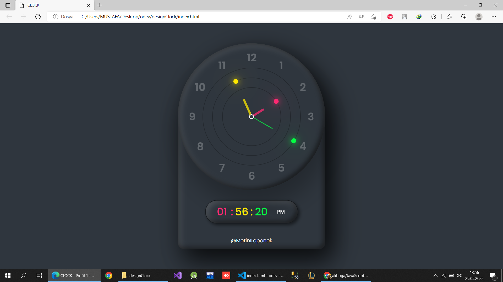

# ⏰ Analog ve Dijital Saat Uygulaması

Bu proje, HTML/CSS ve JavaScript kullanılarak geliştirilmiş bir analog ve dijital saat uygulamasıdır. Kullanıcıya hem grafiksel (analog) hem de metin tabanlı (dijital) olarak güncel saati gösterir.

## 🔧 Kullanılan Teknolojiler

- HTML
- CSS
- JavaScript (Vanilla JS)

## 🕹️ Özellikler

- Gerçek zamanlı çalışan analog saat (akrep, yelkovan, saniye)
- AM/PM destekli dijital saat gösterimi
- Basit ve anlaşılır bir kullanıcı arayüzü
- Saat, dakika ve saniye değerlerinin çift haneli biçimde gösterimi

## 📷 Ekran Görüntüsü

## 📁 Proje Dosya Yapısı

proje-klasörü/
│
├── index.html # HTML dosyası
├── style.css # Stil dosyası
├── clock.js # JavaScript saat fonksiyonları
└── odev/
└── Adsız.png # Saat ekran görüntüsü

markdown
Kopyala
Düzenle

## 🚀 Nasıl Çalıştırılır?

1. Proje klasöründeki `index.html` dosyasını bir tarayıcıda açın.
2. `clock.js` ve `style.css` dosyalarının `index.html` içinde doğru şekilde bağlandığından emin olun.
3. Saat otomatik olarak hem analog hem dijital biçimde çalışacaktır.

## 📝 Lisans

Bu proje açık kaynaklıdır. Dilerseniz kendi projelerinizde kullanabilir ve geliştirebilirsiniz. Henüz özel bir lisans belirtilmemiştir.

## 🤝 Katkı Sağlamak

Her türlü katkıya açığız! Fork'layıp pull request gönderebilir ya da issue açarak geri bildirimde bulun
